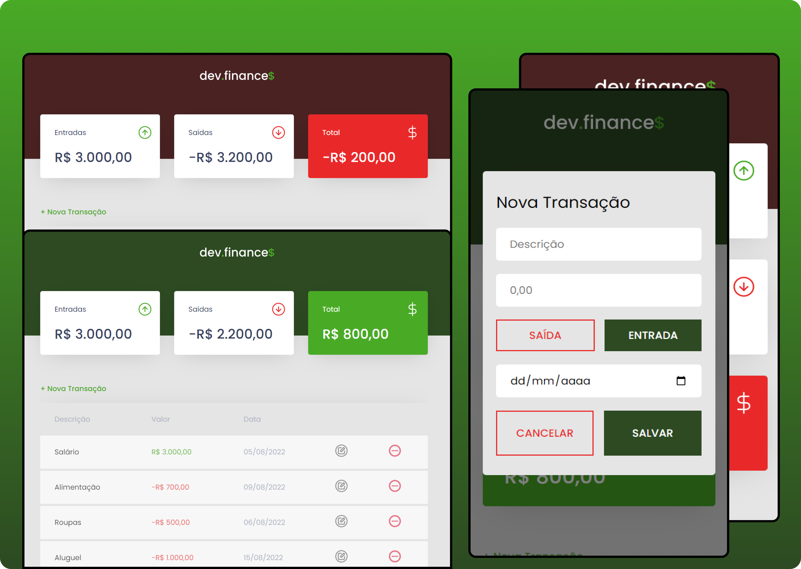

# Dev.Finance$

This project consists in a responsive CRUD financial control system app with the functionalities listed below:

- Theme toggling based on the total balance
- Adding new transactions with its own properties (Description, Amount, Entry or Expense Selection and Date)
- Removing specific transactions
- Editing existing transactions
- Modal Form to get data
- Consulting transactions listed on table
- Saving all data in the localStorage

The project idea and design was proposed by Rocketseat and developed by me.

## Screenshot

## This project was developed with

- HTML
- CSS
- JavaScript

## Author

- [@jv-miranda](https://github.com/jv-miranda)

## Links

